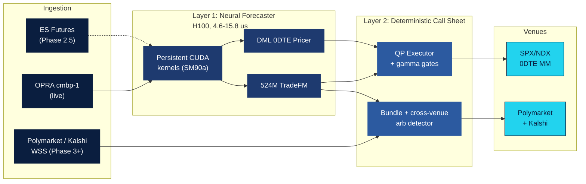

# market-pattern-bot

**Silicon Alpha** — a µs-latency dual-venue trading engine driven by a 524M
decoder-only transformer (TradeFM) trained on exchange-message grammar
from options, futures, and prediction markets.

Designed to deploy simultaneously across:

- **SPX / NDX 0DTE options** (HRT-tier latency, $166–$800 per unit per day
  target)
- **Polymarket / Kalshi prediction markets** (bundle + cross-venue arb,
  0.1–3.0% per cycle)

## Architecture



Full diagram with Phase-4 strategic layer, edge semantics, and HRT-inspired
color key: [`docs/architecture.md`](docs/architecture.md).

## Phase roadmap

| Phase | Scope | Status |
|---|---|---|
| 1 | 40M TradeFM Colab pretrain | ✅ done ([`notebooks/colab_phase1_tradefm.ipynb`](notebooks/colab_phase1_tradefm.ipynb)) |
| 2 | 524M multi-node H100 pretrain on OPRA | 🔄 pipeline validated on Modal; multi-node compute gated |
| 2.5 | Cross-asset fusion (ES futures modality) | 📝 design ([`docs/cross_asset_fusion.md`](docs/cross_asset_fusion.md)) + opt-in scaffold |
| 3 | Persistent-kernel live inference (4.6–15.8 µs) | 📝 kernels scaffolded, not live |
| 4 | Hierarchical RL + MORL + POW-dTS strategic layer | 📝 design only ([`docs/phase4_strategic_layer.md`](docs/phase4_strategic_layer.md)) |

**Rule**: design docs land in `docs/` for any phase gated by unmet
dependencies; code scaffolds only where a clean opt-in guard keeps them
inert until the dependency chain is satisfied.

## Repo layout

```
configs/              tradefm_40m.yml, tradefm_524m.yml, smoke configs
docs/                 architecture.md, cross_asset_fusion.md, phase4_strategic_layer.md
infra/
  gcp/                phase2_a3mega.sh, launch_torchrun_524m.sh, TCPX env
  modal/              phase2_smoke.py (single-node validation suite)
odte/
  data/               databento_pack.py, polygon_pack.py, streaming_quantiles.py,
                      cme_es_pack.py (Phase 2.5 scaffold)
  kernels/            fused_bin.cu, persistent_decode.cu, rdma_ingest.cu (Phase 3)
  train/              distributed.py (FSDP), checkpoint.py, pretrain_tradefm.py
  transformer_tradefm.py  (TradeFM model; optional modality embedding for 2.5)
models/               config.py (TradeFMConfig)
notebooks/            colab_phase0_dml.ipynb, colab_phase1_tradefm.ipynb
tests/                quantile_parity, etc.
STATE.md              detailed project handoff runbook
BUDGET.md             compute + data cost tracking
```

## Phase 2 validation on Modal ($0.50–$3 per run)

Single-node Modal functions validate the full pipeline before committing to
the $50k multi-node run:

```bash
pip install --user modal && python3 -m modal setup

# 40M Hopper-path smoke (fp8 TE, SDPA, FSDP init, ckpt I/O):
python3 -m modal run infra/modal/phase2_smoke.py

# 524M production-config dry run on 1× H100 (proves 524M instantiates,
# FSDP shards 24 layers, optimizer allocates at scale):
python3 -m modal run infra/modal/phase2_smoke.py::dryrun_524m

# Real OPRA shards from Databento (bypasses batch queue via
# pre-completed job reuse; vectorized pack ~8× faster than naive):
python3 -m modal run infra/modal/phase2_smoke.py::dryrun_databento_reuse

# 40M training on real OPRA tape (vs Markov synthetic):
python3 -m modal run infra/modal/phase2_smoke.py::dryrun_train_real

# 8× H100 single-node NCCL smoke (world_size=8, rank-partitioned ckpts):
python3 -m modal run infra/modal/phase2_smoke.py::dryrun_8gpu
```

## Phase 2 production launch (needs GCP quota + billing + $38–50k)

```bash
export GCP_PROJECT=... GCP_BUCKET=gs://... REPO_URL=https://github.com/nahomar/market-pattern-bot.git
./infra/gcp/phase2_a3mega.sh          # provision 3× A3 Mega (24× H100)
./infra/gcp/launch_torchrun_524m.sh   # launch distributed training
```

See [`STATE.md`](STATE.md) for the full runbook including quota prereqs,
cost estimates, and post-launch monitoring.

## Verified Phase-2 smoke results

| Smoke | Result | Cost |
|---|---|---|
| 40M 200-step on Markov shards | loss 112 → 2.48 (below `log(4096)=8.3` uniform floor) | ~$0.25 |
| Checkpoint resume (step 200 → 400) | loaded clean, no re-init corruption | ~$0.25 |
| 524M production-config dry-run | 500 steps, loss 425 → 1.66, 4.87 GB model ckpt | ~$2.70 |
| Databento batch reuse + tokenizer fit on real OPRA | 636M rows, 7-feature edges fitted | ~$3 |

## Related docs

- [`STATE.md`](STATE.md) — handoff runbook, decisions, session log
- [`BUDGET.md`](BUDGET.md) — compute + data cost tracking
- [`docs/architecture.md`](docs/architecture.md) — full flow diagram with HRT palette
- [`docs/cross_asset_fusion.md`](docs/cross_asset_fusion.md) — Phase 2.5 spec
- [`docs/phase4_strategic_layer.md`](docs/phase4_strategic_layer.md) — Phase 4 spec
