# Silicon Alpha — End-to-End Architecture

Full flow from raw exchange feeds + alt-data + fundamental signals
through the neural forecaster, deterministic call sheet, FPGA actor
bridge, agentic governance, and dual-venue execution. Phases 0-2 are
live or in-progress; Phases 2.5-7 are design-only with code scaffolds
where appropriate. The diagram renders natively on GitHub.

```mermaid
flowchart TB
    %% ========== LAYER -1: SOVEREIGN INFRASTRUCTURE SUBSTRATE ==========
    subgraph INFRA["Layer -1 - Sovereign Infrastructure (Phase 8, design only)"]
        direction LR
        TFS["3FS RDMA Storage<br/>40 GiB/s random read<br/>kernel-bypass NVMe pool"]
        ENGRAM["Engram Memory<br/>O(1) DRAM hash lookup<br/>SEC filings + statics"]
        HFR["hfreduce<br/>CPU-overlapped AllReduce<br/>(MoE-only)"]
    end

    %% ========== LAYER 0: REAL-TIME MARKET INGESTION ==========
    subgraph DATA["Layer 0 - Real-time Market Ingestion"]
        direction LR
        OPRA["OPRA cmbp-1<br/>SPX/NDX options<br/>(Databento, live)"]
        ES["ES Futures MBP-1<br/>(GLBX, live since 2026-05-06)"]
        POLY["Polymarket CLOB WSS<br/>(~100ms, Phase 3+)"]
        KAL["Kalshi CLOB WSS<br/>(~100ms, Phase 3+)"]
    end

    %% ========== PHASE 6: ALPHA FACTOR DISCOVERY ==========
    subgraph P6["Phase 6 - Alpha Factor Discovery (design only)"]
        direction LR
        FUND["Fundamental NLP<br/>10-K / 10-Q + earnings<br/>(AlphaSense / LSEG)<br/>DeepSeek 1M-ctx"]
        SYMR["AlphaFormer<br/>symbolic regression<br/>(LSEG Tick BigQuery)<br/>~80 PB tape"]
    end

    %% ========== PHASE 7: ALT DATA ==========
    subgraph P7["Phase 7 - Alternative Data (design only)"]
        direction LR
        PRICE["Bright Data<br/>250+ e-commerce<br/>SKU pricing"]
        TXN["YipitData / Measurable AI<br/>2M+ user receipts<br/>weekly SKU txns"]
        TALENT["PredictLeads<br/>job-posting flow<br/>3-6mo lead signal"]
    end

    %% ========== LAYER 1: NEURAL FORECASTER ==========
    subgraph L1["Layer 1 - Neural Forecaster (target: 4.6-15.8 us @ H100)"]
        direction TB
        RDMA["GPUDirect RDMA<br/>HBM3 ring buffer"]
        KERNEL["Persistent CUDA Kernels<br/>SM90a always-resident"]
        TFM["524M TradeFM<br/>multi-modal token attn"]
        DML["DML Pricer<br/>0DTE Greeks + IV"]
        RDMA --> KERNEL
        KERNEL --> TFM
        KERNEL --> DML
    end

    %% ========== LAYER 2: CALL SHEET ==========
    subgraph L2["Layer 2 - Deterministic Call Sheet"]
        direction TB
        QP["QP Executor<br/>risk-adjusted w*"]
        GAMMA["Gamma / VaR Gates<br/>software kill-switch"]
        ARB["Bundle Arb Detector<br/>YES + NO =/= $1.00"]
        XV["Cross-Venue Arb<br/>Polymarket &lt;-&gt; Kalshi"]
    end

    %% ========== LAYER 1.5: FPGA ACTOR ==========
    subgraph FPGA["Layer 1.5 - FPGA Actor (Phase 3.5, design only)"]
        direction TB
        P2P["PCIe P2P DMA<br/>GPU HBM3 -&gt; FPGA BAR"]
        HWKILL["Hardware Kill-Switch<br/>&lt;100ns dead-man"]
        OUCH["OUCH/FIX Encoder<br/>tick-to-trade &lt; 450ns"]
        P2P --> HWKILL --> OUCH
    end

    %% ========== LAYER 3: STRATEGIC ==========
    subgraph L3["Layer 3 - Strategic (Phase 4, design only)"]
        direction LR
        HLC["HLC PPO<br/>strategy weights<br/>+ capital allocator<br/>+ child-order slicing"]
        POW["POW-dTS<br/>regime adapter"]
        MORL["MORL reward<br/>[pnl, -IS, -DD,<br/>-gamma, -conc, up]"]
    end

    %% ========== LAYER 4: AGENTIC GOVERNANCE ==========
    subgraph AGENTS["Layer 4 - Agentic Governance (Phase 5 + Phase 8 QRAFTI)"]
        direction LR
        RES["Research Agent<br/>proposes signal mods"]
        DEV["Quant Dev Agent<br/>auto-PR + code repair<br/>(Phase 8)"]
        RISK["Risk Agent<br/>KKT validation<br/>+ hard veto"]
        COMP["Compliance Agent<br/>hash-chained<br/>audit trail"]
    end

    %% ========== VENUES ==========
    subgraph VEN["Execution Venues"]
        direction LR
        SPX["SPX/NDX 0DTE<br/>$166-$800 per unit / day<br/>MM + toxic-flow avoidance"]
        PM["Polymarket<br/>0.1-3.0% per arb cycle<br/>bundle + cross-venue"]
        KS["Kalshi<br/>0.1-3.0% per arb cycle<br/>market pull on catalysts"]
    end

    %% ========== EDGES — LIVE / SOLID ==========
    OPRA --> RDMA
    TFM --> QP
    DML --> QP
    QP --> GAMMA
    GAMMA -.software path.-> SPX
    POLY --> ARB
    KAL --> ARB
    TFM --> ARB
    ARB --> PM
    ARB --> KS
    ARB --> XV
    XV --> PM
    XV --> KS

    %% ========== EDGES — PHASE-GATED / DASHED ==========
    TFS -.Phase 8 substrate.-> KERNEL
    TFS -.Phase 8 substrate.-> TFM
    ENGRAM -.Phase 8 lookup.-> TFM
    HFR -.Phase 8 MoE only.-> TFM
    ES -.cross-asset.-> RDMA
    FUND -.Phase 6.-> TFM
    SYMR -.Phase 6.-> TFM
    PRICE -.Phase 7.-> TFM
    TXN -.Phase 7.-> TFM
    TALENT -.Phase 7.-> TFM
    GAMMA -.FPGA path.-> P2P
    OUCH -.wire.-> SPX
    HLC -.Phase 4.-> QP
    POW -.Phase 4.-> HLC
    MORL -.Phase 4.-> HLC
    SPX -.trade logs.-> MORL
    PM -.trade logs.-> MORL
    KS -.trade logs.-> MORL
    RES -.proposes.-> HLC
    RES -.proposes.-> TFM
    RES -.proposes signal mods.-> DEV
    DEV -.draft PR.-> RISK
    RISK -.validates KKT.-> QP
    RISK -.hard veto.-> P2P
    DEV -.logs.-> COMP
    QP -.logs.-> COMP
    P2P -.logs.-> COMP
    SPX -.logs.-> COMP
    PM -.logs.-> COMP
    KS -.logs.-> COMP

    %% ========== HRT-INSPIRED STYLING ==========
    %% Near-black foundation, HRT warm orange primary, deeper orange mid,
    %% peach (dashed) for design-only phases, cream for terminal venues.
    classDef data fill:#1A1A1A,stroke:#1A1A1A,stroke-width:2px,color:#F8F5F0
    classDef layer1 fill:#E85D2E,stroke:#E85D2E,stroke-width:2px,color:#ffffff
    classDef layer2 fill:#D94F23,stroke:#D94F23,stroke-width:2px,color:#ffffff
    classDef phaseDesign fill:#F4A261,stroke:#D94F23,stroke-width:2px,color:#1A1A1A,stroke-dasharray:5 3
    classDef venue fill:#F8F5F0,stroke:#E85D2E,stroke-width:3px,color:#1A1A1A

    class OPRA,ES,POLY,KAL data
    class RDMA,KERNEL,TFM,DML layer1
    class QP,GAMMA,ARB,XV layer2
    class P2P,HWKILL,OUCH phaseDesign
    class HLC,POW,MORL phaseDesign
    class RES,DEV,RISK,COMP phaseDesign
    class FUND,SYMR phaseDesign
    class PRICE,TXN,TALENT phaseDesign
    class TFS,ENGRAM,HFR phaseDesign
    class SPX,PM,KS venue
```

## Legend

HRT-inspired palette: near-black foundation, warm orange for the active
neural + execution tiers, pale peach with dashed borders for design-only
phases, warm cream for terminal execution venues.

| Color | Layer | Phase | Status |
|---|---|---|---|
| Near-black `#1A1A1A` | Real-time market ingestion | 0 | OPRA live; ES scaffold; Poly/Kalshi pending signup |
| HRT orange `#E85D2E` | Neural Forecaster | 1 | Kernels scaffolded; TradeFM untrained (Phase 2 compute-blocked) |
| Deep orange `#D94F23` | Call Sheet | 2 | QP/Gamma not wired live; arb detectors 0% |
| Peach `#F4A261` (dashed) | Cross-asset / FPGA / Strategic / Agentic / Alpha-Discovery / Alt-Data / Sovereign Infra | 2.5 / 3.5 / 4 / 5 / 6 / 7 / 8 | **Design-only** — see per-phase doc |
| Cream `#F8F5F0` + orange border | Venues | deploy | All pending broker/API integration |

## Phase-by-phase doc map

| Phase | Doc | Code status |
|---|---|---|
| 1 | `notebooks/colab_phase1_tradefm.ipynb` | done |
| 2 | `infra/gcp/phase2_a3mega.sh`, `odte/train/distributed.py` | pipeline validated, compute-gated |
| 2.5 | [`cross_asset_fusion.md`](cross_asset_fusion.md) | **live** — ES + SPY MBP-1 packed, multimodal interleaver functional, training launching on Sol A100 |
| 3 | `odte/kernels/*.cu` | scaffold |
| 3.5 | [`fpga_bridge.md`](fpga_bridge.md) | design only |
| 4 | [`phase4_strategic_layer.md`](phase4_strategic_layer.md) | design only |
| 5 | [`agentic_governance.md`](agentic_governance.md) | design only |
| 6 | [`phase6_alpha_factor_discovery.md`](phase6_alpha_factor_discovery.md) | design only |
| 7 | [`phase7_alternative_data.md`](phase7_alternative_data.md) | design only |
| 8 | [`phase8_sovereign_infrastructure.md`](phase8_sovereign_infrastructure.md) | design only |

## Edge semantics

- **Solid arrows**: live data/control flow (design intent for Phases 0-2)
- **Dashed arrows**: phase-gated — design spec exists, wiring pending
  upstream completion
- All Phase-6 and Phase-7 channels feed the same TradeFM forecaster
  via the `modality_vocab` embedding mechanism (already scaffolded for
  Phase-2.5)

## Critical path today

1. ✅ OPRA ingestion (Databento, 5 days April 2026)
2. ✅ Streaming tokenizer fit on real MBP-1 tape
3. ✅ Real-data 40M training smoke (loss 1.97 on 1 day)
4. ✅ 8-GPU FSDP + NCCL validated on real OPRA (Modal)
5. ✅ Multi-node FSDP + InfiniBand validated on Sol (2026-05-05)
6. ✅ ES + SPY (NBBO + NASDAQ L3) acquired and packed (2026-05-06)
7. ✅ Multimodal interleaver — 510M-row corpus (~3.6B tokens) merged
8. 🔄 524M multimodal pretrain — launching on Sol A100, single-GPU (queued)
9. 🔄 Full 6-day OPRA download from Modal (Mac, background)
10. ❌ 524M multi-day multimodal retrain on full corpus — blocked on (9)
11. ❌ Phase 3 persistent-kernel live inference — blocked on (8)
12. ❌ Broker / exchange order submission — blocked on (11)
13. ❌ Phase 3.5 FPGA bridge — blocked on (12) + $15-30k card + HDL engineer
14. ❌ Phase 4 strategic layer — blocked on (12) + live trade logs
15. ❌ Phase 5 agentic governance — blocked on (12) + QP solver live
16. ❌ Phase 6 alpha factor discovery — blocked on (8) + AUM justifying $250k+/yr data
17. ❌ Phase 7 alt-data integration — blocked on (16) + AUM justifying $140k+/yr data
18. ❌ Phase 8 sovereign infrastructure (3FS + Engram + MoE + QRAFTI Quant Dev) — blocked on (8) hitting capacity ceiling + capex for 3FS pool ($200k-$1M)
